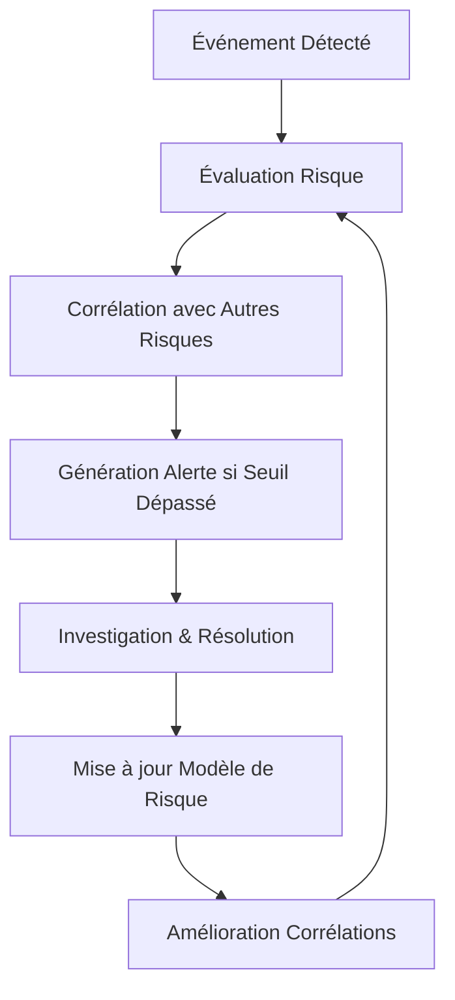
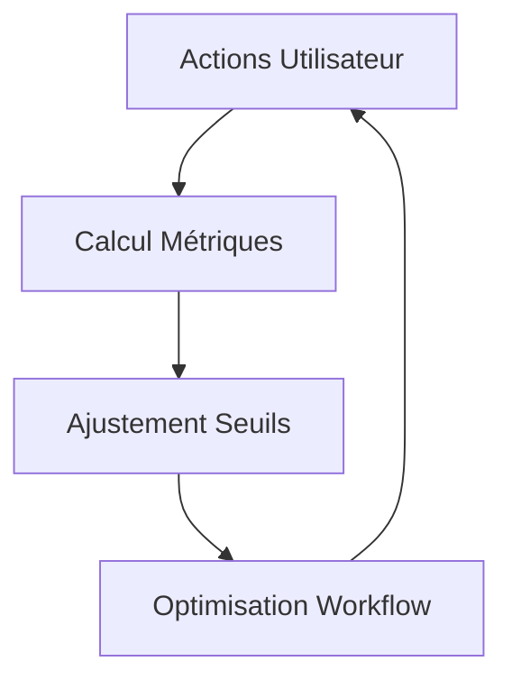

# 🗄️ Database UML Design - Hedi Document Guardian

## Executive Summary

Le système Hedi Document Guardian est une plateforme anti-fraude sophistiquée pour l'assurance, centrée autour de l'**évaluation et gestion des Risques**. Le schéma de base de données supporte la détection de fraude, la corrélation des risques, la gestion des dossiers, et la conformité réglementaire. **Risque** est le hub central qui orchestre toute la détection de fraude et les décisions d'investigation.

---

## 📊 Diagramme UML - Vue d'Ensemble

```mermaid
erDiagram
    %% USERS & TEAMS
    users ||--o{ team_assignments : has
    functional_teams ||--o{ team_assignments : includes
    users ||--o{ assures : manages
    
    %% RISK-CENTRIC ARCHITECTURE (HUB CENTRAL)
    risques ||--o{ risque_correlations : primary_risk
    risques ||--o{ risque_correlations : correlated_risk
    risques ||--o{ alerts : generates
    risques ||--o{ cases : triggers
    risques ||--o{ cycle_vie_actions : influences
    
    %% ALL ENTITIES CONNECT TO RISK HUB
    assures ||--o{ risques : has_profile
    evenements ||--o{ risques : assessed_by
    historique ||--o{ risques : triggers_analysis
    cycles_vie ||--o{ risques : monitored_by
    
    %% CORE ENTITIES
    assures ||--o{ assure_contracts : has
    assures ||--o{ cycles_vie : undergoes
    assures ||--o{ evenements : submits
    assures ||--o{ historique : generates
    assures ||--o{ alerts : subject_of
    
    %% LIFECYCLE MANAGEMENT
    cycles_vie ||--o{ cycle_vie_stage_history : tracks
    cycles_vie ||--o{ historique : produces
    
    %% EVENT MANAGEMENT (DEMANDES → EVENEMENTS)
    evenements ||--o{ evenement_versions : versioned
    evenements ||--o{ historique : creates
    
    %% FRAUD DETECTION (RISK-DRIVEN)
    alerts ||--o{ case_alerts : grouped_in
    cases ||--o{ case_alerts : contains
    cases ||--o{ case_handovers : transferred
    alerts ||--o{ cases : escalated_to
    
    users {
        uuid id PK
        varchar clerk_id UK
        varchar name
        varchar email UK
        text avatar_url
        user_role role
        territory_enum territory
        permission_enum technical_permission
        user_status status
        availability_enum availability_status
        timestamp joined_at
        timestamp last_active_at
        timestamp created_at
        timestamp updated_at
    }
    
    functional_teams {
        uuid id PK
        varchar name
        team_specialty specialty
        text description
        integer average_processing_time_hours
        decimal cost_per_hour
        integer sla_hours
        text_array specialties
        text_array certifications
        boolean is_active
        integer max_capacity
        time working_hours_start
        time working_hours_end
        varchar working_hours_timezone
        timestamp created_at
        timestamp updated_at
    }
    
    team_assignments {
        uuid id PK
        uuid user_id FK
        uuid team_id FK
        uuid assigned_by FK
        timestamp assigned_at
        team_assignment_role role
        text notes
    }
    
    assures {
        uuid id PK
        varchar numero_client UK
        assure_type type
        assure_status status
        jsonb identity
        integer risk_score
        risk_level_enum risk_level
        decimal risk_confidence
        integer nombre_sinistres
        decimal montant_total_sinistres
        integer nombre_alertes
        integer nombre_dossiers_fraude
        integer frequence_modifications
        integer delai_declaration_moyen
        integer coherence_documents
        text_array facteurs_durcissement
        text_array facteurs_mitigation
        decimal total_premiums
        decimal customer_lifetime_value
        text_array lines_of_business
        integer anciennete_client
        varchar gestionnaire
        varchar agence
        varchar segment
        timestamp created_at
        uuid created_by FK
        timestamp updated_at
        timestamp last_login_at
        timestamp data_validated_at
        timestamp derniere_mise_a_jour_risque
        timestamp prochaine_review
    }
    
    assure_contracts {
        uuid id PK
        uuid assure_id FK
        varchar policy_number UK
        varchar line_of_business
        date date_debut
        date date_fin
        decimal prime_annuelle
        contract_status status
        jsonb vehicule_info
        jsonb habitation_info
        timestamp created_at
        timestamp updated_at
    }
    
    cycles_vie {
        uuid id PK
        uuid assure_id FK
        uuid contract_id FK
        cycle_vie_stage current_stage
        cycle_vie_status status
        integer progression
        jsonb souscription_data
        jsonb vie_contrat_data
        jsonb sinistre_paiement_data
        jsonb resiliation_data
        integer duree_etape_actuelle
        integer duree_totale
        integer nombre_modifications
        integer nombre_sinistres
        decimal montant_total_primes
        decimal montant_total_indemnisations
        decimal ratio_sinistralite
        boolean validation_requise
        timestamp prochaine_milestone
        text_array actions_pendantes
        text_array documents_manquants
        timestamp created_at
        uuid created_by FK
        timestamp updated_at
        timestamp last_activity_at
    }
    
    cycle_vie_stage_history {
        uuid id PK
        uuid cycle_vie_id FK
        cycle_vie_stage stage
        timestamp entered_at
        timestamp exited_at
        integer duration_days
        varchar triggered_by
        varchar triggered_by_type
        jsonb metadata
    }
    
    evenements {
        uuid id PK
        varchar reference_externe
        varchar numero_suivi UK
        evenement_type type
        evenement_category category
        evenement_status status
        evenement_priority priority
        evenement_origin origin
        evenement_channel channel
        jsonb source_info
        jsonb demandeur_info
        uuid assure_id FK
        varchar objet
        text description
        text motivation
        jsonb donnees_specifiques
        jsonb contexte_business
        jsonb documents
        jsonb workflow_state
        timestamp date_reception
        integer delai_reglementaire
        integer delai_commercial
        timestamp date_echeance
        timestamp date_traitement
        boolean respect_sla
        text retard_justification
        jsonb communications
        uuid assigne_a FK
        uuid equipe_traitante FK
        timestamp date_assignation
        jsonb historique_traitement
        varchar decision_type
        text decision_motif
        text_array decision_conditions
        decimal montant_accorde
        timestamp date_decision
        uuid decideur FK
        varchar voie_recours
        integer note_complexite
        integer temps_traitement
        integer nombre_aller_retours
        jsonb erreurs
        jsonb satisfaction
        integer score_urgence
        integer score_complexite
        integer impact_business
        decimal cout_traitement
        decimal valeur_client
        decimal rentabilite
        jsonb conformite
        integer version
        text_array tags
        text_array flags
        jsonb custom_fields
        jsonb integration_data
        timestamp created_at
        uuid created_by FK
        timestamp updated_at
        uuid last_modified_by FK
        timestamp archived_at
    }
    
    evenement_versions {
        uuid id PK
        uuid evenement_id FK
        integer version
        timestamp modified_at
        uuid modified_by FK
        text changes_description
        jsonb snapshot
    }
    
    historique {
        uuid id PK
        uuid assure_id FK
        uuid cycle_vie_id FK
        uuid evenement_id FK
        historique_event_type event_type
        historique_category category
        historique_source source
        historique_impact impact
        varchar title
        text description
        varchar short_summary
        jsonb business_context
        uuid triggered_by FK
        varchar triggered_by_name
        varchar triggered_by_role
        uuid_array affected_users
        jsonb related_entities
        jsonb metadata
        event_status status
        boolean requires_action
        text action_required
        timestamp due_date
        timestamp completed_at
        jsonb raw_data
        jsonb enriched_data
        jsonb external_references
        jsonb location_info
        jsonb device_info
        timestamp created_at
        timestamp updated_at
        integer version
        jsonb corrections
        jsonb insights
    }
    
    risques {
        uuid id PK
        uuid assure_id FK
        uuid cycle_vie_id FK
        uuid historique_id FK
        risque_type type
        risque_category category
        risque_level level
        risque_status status
        risque_source source
        varchar title
        text description
        varchar short_description
        integer base_score
        integer adjusted_score
        integer final_score
        decimal confidence
        jsonb component_scores
        jsonb adjustment_factors
        jsonb quality_metrics
        jsonb risk_factors
        jsonb potential_impact
        jsonb business_context
        jsonb related_entities
        jsonb evidence
        jsonb mitigation
        jsonb monitoring
        jsonb predictions
        timestamp created_at
        uuid created_by FK
        timestamp updated_at
        timestamp last_review_at
        uuid last_review_by FK
        integer version
        jsonb score_history
        text_array tags
        jsonb custom_fields
        boolean requires_approval
        uuid approved_by FK
        timestamp approved_at
        uuid escalated_to FK
        timestamp escalated_at
        uuid closed_by FK
        timestamp closed_at
        text closure_reason
    }
    
    risque_correlations {
        uuid id PK
        uuid primary_risque_id FK
        uuid correlated_risque_id FK
        correlation_type_enum correlation_type
        decimal strength
        decimal confidence
        jsonb analysis
        jsonb impact
        timestamp detected_at
        uuid validated_by FK
        timestamp validated_at
    }
    
    alerts {
        uuid id PK
        varchar external_id
        alert_source source
        varchar source_module
        varchar type
        alert_severity severity
        integer score
        decimal confidence
        jsonb metadata
        alert_status status
        alert_qualification qualification
        text qualification_notes
        uuid assigned_to FK
        uuid assigned_by FK
        timestamp assigned_at
        uuid team FK
        jsonb raw_data
        jsonb enriched_data
        timestamp created_at
        uuid created_by FK
        timestamp updated_at
        timestamp qualified_at
        uuid qualified_by FK
    }
    
    cases {
        uuid id PK
        varchar reference UK
        varchar sinister_number
        varchar policy_number
        varchar insured_name
        uuid primary_alert_id FK
        case_status status
        case_priority priority
        uuid investigator FK
        varchar investigator_name
        uuid supervisor FK
        varchar supervisor_name
        uuid qualified_by FK
        varchar qualified_by_name
        investigation_team_enum investigation_team
        case_decision decision
        text decision_reason
        timestamp decision_date
        decimal estimated_loss
        decimal recovered_amount
        decimal prevented_amount
        decimal investigation_cost
        decimal total_roi
        jsonb timeline
        text_array notes
        text_array tags
        text_array fraud_types
        timestamp created_at
        uuid created_by FK
        varchar created_by_name
        timestamp updated_at
        timestamp closed_at
    }
    
    case_alerts {
        uuid case_id PK,FK
        uuid alert_id PK,FK
        timestamp added_at
        uuid added_by FK
    }
    
    case_handovers {
        uuid id PK
        uuid case_id FK
        uuid from_user FK
        uuid from_team FK
        varchar from_role
        uuid to_user FK
        uuid to_team FK
        varchar to_role
        text reason
        jsonb metadata
        timestamp timestamp
    }
```



---

## 🏗️ Architecture des Relations

### **Entité Centrale : Risque**
Le **Risque** est le hub central du système qui orchestre toute la détection de fraude :
- **N:M** avec Risques (corrélations complexes via risque_correlations)
- **1:N** avec Alertes (génération d'alertes basées sur les seuils de risque)
- **1:N** avec Dossiers (déclenchement d'investigations selon le niveau de risque)
- **N:1** avec Assurés (profil de risque agrégé par client)
- **N:1** avec Événements (évaluation de risque pour chaque événement)
- **N:1** avec Historique (analyse des patterns historiques)
- **1:N** avec Actions CycleVie (influence sur les décisions de cycle de vie)

### **Relations Clés Business**

#### **1. Workflow Principal (Risk-Centric)**
```
Événement → Historique → RISQUE (HUB) → Alerte → Dossier → Résolution
                           ↓
                    Corrélation ← Autres Risques
```

#### **2. Gestion des Équipes**
```
Utilisateurs ←→ Équipes (N:M via team_assignments)
Utilisateurs → Assurés (1:N - gestionnaire attitré)
```

#### **3. Corrélation des Risques (Système Nerveux Central)**
```
Risque A ←→ Risque B ←→ Risque C (N:M via risque_correlations)
    ↓           ↓           ↓
 Alerte X    Alerte Y    Pattern Global → Investigation Systémique
```

#### **4. Génération d'Alertes Pilotée par les Risques**
```
Risque (seuil dépassé) → Alerte → Groupement → Dossier d'Investigation
```

---

## 📋 Types de Données & Enums

### **Rôles Utilisateurs**
```sql
CREATE TYPE user_role AS ENUM (
    'gestionnaire',     -- Front-line processing
    'superviseur',      -- Team management
    'direction',        -- Strategic oversight
    'admin'            -- System administration
);
```

### **Statuts de Cycle de Vie**
```sql
CREATE TYPE cycle_vie_stage AS ENUM (
    'souscription',         -- Initial subscription
    'vie_contrat',         -- Active contract period
    'sinistre_paiement',   -- Claim processing
    'resiliation'          -- Contract termination
);
```

### **Types d'Événements**
```sql
CREATE TYPE evenement_type AS ENUM (
    -- Contractuels
    'souscription_contrat', 'modification_contrat', 'renouvellement', 'resiliation',
    -- Sinistres
    'declaration_sinistre', 'complement_sinistre', 'contestation_decision',
    -- Service Client
    'demande_info', 'reclamation', 'attestation', 'duplicata',
    -- Techniques
    'integration_api', 'webhook_externe', 'batch_import',
    -- Détection de Fraude
    'pattern_detection', 'behavior_anomaly', 'document_inconsistency'
);
```

### **Types de Risques**
```sql
CREATE TYPE risque_type AS ENUM (
    'fraude_documentaire',  -- Document forgery
    'fraude_identite',      -- Identity fraud
    'fraude_sinistre',      -- Claims fraud
    'fraude_souscription',  -- Subscription fraud
    'blanchiment',          -- Money laundering
    'cyber_fraude'          -- Cyber fraud
);
```

---

## 🔍 Index & Performance

### **Index Critiques**
```sql
-- Recherche par entité métier
CREATE INDEX idx_assures_numero_client ON assures(numero_client);
CREATE INDEX idx_evenements_numero_suivi ON evenements(numero_suivi);

-- INDEX CRITIQUES POUR RISQUE (HUB CENTRAL)
CREATE INDEX idx_risques_final_score ON risques(final_score DESC);
CREATE INDEX idx_risques_level ON risques(level);
CREATE INDEX idx_risques_status ON risques(status);
CREATE INDEX idx_risques_assure ON risques(assure_id);
CREATE INDEX idx_risque_correlations_primary ON risque_correlations(primary_risque_id);
CREATE INDEX idx_risque_correlations_strength ON risque_correlations(strength DESC);

-- Workflow et assignation
CREATE INDEX idx_evenements_status ON evenements(status);
CREATE INDEX idx_evenements_assignee ON evenements(assigne_a);
CREATE INDEX idx_alerts_assigned_to ON alerts(assigned_to);

-- Analyse temporelle
CREATE INDEX idx_historique_created_at ON historique(created_at DESC);
CREATE INDEX idx_evenements_echeance ON evenements(date_echeance);

-- Scoring et priorité
CREATE INDEX idx_risques_score ON risques(final_score DESC);
CREATE INDEX idx_alerts_severity ON alerts(severity);

-- Recherche JSON (métadonnées)
CREATE INDEX idx_evenements_metadata_gin ON evenements USING GIN (contexte_business);
CREATE INDEX idx_alerts_metadata_gin ON alerts USING GIN (metadata);
CREATE INDEX idx_risques_metadata_gin ON risques USING GIN (risk_factors);
CREATE INDEX idx_risques_correlations_analysis_gin ON risque_correlations USING GIN (analysis);
```

---

## 🎯 Contraintes Business

### **Validation des Scores**
```sql
-- Scores de risque : 0-100
CHECK (risk_score >= 0 AND risk_score <= 100)
CHECK (final_score >= 0 AND final_score <= 100)

-- Confiance : 0-1
CHECK (confidence >= 0 AND confidence <= 1)
```

### **Cohérence Temporelle**
```sql
-- Les échéances doivent être dans le futur
CHECK (date_echeance >= date_reception)

-- Les contrats doivent avoir des dates cohérentes
CHECK (date_fin IS NULL OR date_fin >= date_debut)
```

### **Intégrité Référentielle**
```sql
-- Tous les événements doivent avoir un créateur
NOT NULL created_by REFERENCES users(id)

-- Les assignations doivent pointer vers des utilisateurs actifs
FOREIGN KEY (assigned_to) REFERENCES users(id)
```

---

## 📊 Métriques & KPIs Calculés

### **Calcul de Risque Centralisé (Hub Central)**
```sql
-- Moteur de calcul de risque multi-dimensionnel
final_risk_score = (
    base_score + 
    correlation_boost +
    temporal_weight +
    (nombre_alertes_confirmees * 15) + 
    (patterns_fraude_historiques * 20) -
    (confiance_historique * 5)
) BOUNDED BY [0, 100]

-- Avec corrélations cross-entités
correlation_strength = WEIGHTED_AVERAGE(
    behavioral_correlation * 0.3,
    temporal_correlation * 0.2,
    contextual_correlation * 0.5
)
```

### **ROI des Dossiers**
```sql
-- Calcul ROI des investigations
total_roi = (recovered_amount + prevented_amount) - investigation_cost
```

### **Performance Utilisateur**
```sql
-- Métriques de performance (calculées)
- Nombre d'alertes traitées par utilisateur
- Temps moyen de traitement
- Taux de précision (fraude confirmée / total qualifié)
- Respect des SLA
```

---

## 🔄 Boucles de Feedback

### **1. Risk-Centric Intelligence Loop**


### **2. Performance Feedback Loop**


---

## 🚀 Évolution & Scalabilité

### **Partitioning Strategy**
```sql
-- Partitioning par mois pour l'historique
CREATE TABLE historique_2024_01 PARTITION OF historique 
FOR VALUES FROM ('2024-01-01') TO ('2024-02-01');

-- Partitioning par niveau de risque
CREATE TABLE risques_critical PARTITION OF risques 
FOR VALUES IN ('critical', 'very_high');
```

### **Archive Strategy**
```sql
-- Archivage automatique après 7 ans
UPDATE demandes SET archived_at = NOW() 
WHERE created_at < NOW() - INTERVAL '7 years';
```

---

## 💾 Stockage Actuel

**⚠️ IMPORTANT :** Actuellement, toutes les données sont stockées **EN MÉMOIRE UNIQUEMENT** dans les services TypeScript et sont perdues au redémarrage.

### **Localisation Actuelle**
- **userRoleService.ts** : `Map<string, UserWithRole>`
- **teamService.ts** : `FunctionalTeam[]`
- **alertService.ts** : `Alert[]`
- **caseService.ts** : `Case[]`
- **assureService.ts** : `Assure[]`
- **risqueService.ts** : `Risque[]` ← **HUB CENTRAL**
- **risqueService.ts** : `RisqueCorrelation[]` ← **CORRÉLATIONS**

### **Migration Recommandée**
1. **Phase 1** : PostgreSQL avec ce schéma UML
2. **Phase 2** : API REST pour intégration
3. **Phase 3** : Sync Clerk metadata pour les rôles
4. **Phase 4** : Cache Redis pour performance

---

Ce design UML fournit une architecture complète et évolutive pour supporter toute la complexité métier du système anti-fraude Hedi Document Guardian.